[](https://central.sonatype.com/artifact/io.github.lunalobos/chess4kt)
[](https://chess4kt.pages.dev/)
[](https://www.npmjs.com/package/chess4js)

# Chess4kt

---

## Overview

This library provides the necessary components to perform and represent **chess-related operations**, such as position management, legal move calculation, move and game representation, and PGN file parsing.

The types and functions are designed for **intuitive and fluid use**. The library is currently in its first beta version.

***

## Guide

The following is an overview of the library's most important types and functions. For more details, see the [documentation](https://chess4kt.pages.dev/).

### Square

[`Square`](https://chess4kt.pages.dev/core/io.github.lunalobos.chess4kt/-square/) class is an **enum that represents a square on the chessboard**. The **ordinal** property of each instance is highly relevant, as the library uses its integer ordinal value (Int) as the internal equivalent of a square. The standard index order is **file-major**, where A1 is 0, B1 is 1, up to H8 which is 63.

```kotlin
val a1 = Square.A1.ordinal // A1 -> 0
val b1 = Square.B1.ordinal // B1 -> 1
// and so on
val h8 = Square.H8.ordinal // H8 -> 63
````

### Piece

[`Piece`](https://chess4kt.pages.dev/core/io.github.lunalobos.chess4kt/-piece/) class is an **enum that represents a chess piece** on the board. The **ordinal** property of each instance is relevant, since the library uses this ordinal value (Int) as the internal piece identifier. The order starts with `EMPTY` (0), followed by White pieces, then Black pieces:

```kotlin
val empty = Piece.EMPTY.ordinal // empty -> 0
val wp = Piece.WP.ordinal // white pawn -> 1
val wn = Piece.WN.ordinal // white knight -> 2
val wb = Piece.WB.ordinal // white bishop -> 3
val wr = Piece.WR.ordinal // white rook -> 4
val wq = Piece.WQ.ordinal // white queen -> 5
val wk = Piece.WK.ordinal // white king -> 6
val bp = Piece.BP.ordinal // black pawn -> 7
val bn = Piece.BN.ordinal // black knight -> 8
val bb = Piece.BB.ordinal // black bishop -> 9
val br = Piece.BR.ordinal // black rook -> 10
val bq = Piece.BQ.ordinal // black queen -> 11
val bk = Piece.BK.ordinal // black king -> 12
```

### Position

The [`Position`](https://chess4kt.pages.dev/core/io.github.lunalobos.chess4kt/-position/) 
class allows you to represent a specific chess position. It is **immutable**, which simplifies state management. To create a position, you can use the factory function [`positionOf`](https://chess4kt.pages.dev/core/io.github.lunalobos.chess4kt/position-of) with or without argument.

```kotlin
val startpos = positionOf() // without argument, the function returns the initial position

// but if you provide a FEN string, the indicated position is generated
val spanishOpening = positionOf("r1b2rk1/2q1bppp/p2p1n2/npp1p3/3PP3/2P2N1P/PPBN1PP1/R1BQR1K1 b - - 2 12")
```

`Position` constructors are marked **internal** and are not accessible to external users. When a FEN string is provided, the factory function `positionOf` verifies that it is valid and results in a legal position.

`Position` objects have several properties that allow you to work with the position internal state, such as **bitboards**, en passant status, and turn:

```kotlin
val position = positionOf() // startpos
val bitboards = position.bitboards // an array of long integers; each element is a bitboard
val whiteQueenBitboard = bitboards[Piece.WQ.ordinal - 1] // white queen's bitboard
val enPassant = position.enPassant // the square (as an integer index) of the en passant target, or -1 if none exists
val whiteMove = position.whiteMove // a boolean value: true if it's White's turn to move; false if it's Black's turn.
```

A very important feature of this class is the extension property **`children`**. It is a list of [tuples](https://chess4kt.pages.dev/core/io.github.lunalobos.chess4kt/-tuple/) (`Position`, `Move`) that encompasses all **legal moves** derived from the position.

```kotlin
val position = positionOf()
val children = position.children // list of all legal moves and resulting positions from the starting position
```

If a legal move is known, it can be executed from the position, and a new `Position` object derived from this move can be obtained.

```kotlin
val position = positionOf()
// The move is provided in the modified long algebraic notation used in the UCI protocol
val afterE4 = position.move("e2e4") 
```

The move above was executed using the **UCI notation** (Universal Chess Interface, e.g., `e2e4`), which is the default for the `move` function. This notation only needs the origin and destination squares and the promotion piece, if any.

However, you can also provide the move in **Standard Algebraic Notation (SAN)**. This is possible because the `move` extension function in `Position` has a second parameter, `notation` (of type [`Notation`](https://chess4kt.pages.dev/core/io.github.lunalobos.chess4kt/-notation/)), which can be set to `Notation.SAN`.

```kotlin
val afterE4 = position.move("e4", Notation.SAN) // the move is provided in SAN notation
```

See the [documentation](https://chess4kt.pages.dev/core/io.github.lunalobos.chess4kt/-position/) for more features of this class,

### Move

The [`Move`](https://chess4kt.pages.dev/core/io.github.lunalobos.chess4kt/-move/) class represents **a single player's action**. It contains the origin, target, and promotion piece properties (all as integers) and is **immutable**. There are many ways to create an instance of this class using the factory function `moveOf`:

```kotlin
val move = moveOf("e2e4") // Must be provided in UCI notation; SAN notation is not possible due to ambiguity
val otherMove = moveOf(origin = Square.A1, target = Square.B2) // Integer indices or Square enums can be used
val promotionMove = moveOf(Square.G2, Square.G1, Piece.BQ) // Promotion to Black Queen
```

### Game

The [`Game`](https://chess4kt.pages.dev/core/io.github.lunalobos.chess4kt/-game/) class is used to **represent entire games**, whether they are for serious competitive matches or for analysis (with variations, ratings, and comments).

* **Game Mode:** `Game` instances have a game mode represented by the internal enum [`GameMode`](https://chess4kt.pages.dev/core/io.github.lunalobos.chess4kt/-game/-game-mode/), which has two values: `ANALYSIS` and `MATCH`.
* **Structure:** Games are composed of **metadata** (PGN tags) and a series of connected **nodes** (of type [`Node`](https://chess4kt.pages.dev/core/io.github.lunalobos.chess4kt/-game/-node/)) that form a game tree.

In **Match** mode, these nodes form a **simple linked list** (variations are typically not allowed). In **Analysis** mode, the nodes form a **tree**, enabling the storage of Recursive Annotation Variations (RAVs).

```mermaid

---
config:
  theme: neo-dark
  layout: dagre
  look: classic
---
flowchart LR
subgraph subGraph0["Game Tree"]
B["MoveNode
(1. e4 - First move)"]
A["Node
(Start position of the game)"]
C@{ label: "Node\n        (1... c5 - Black's response)" }
D["Node
(2. Nf3 - Next main move)"]
E["Node
(2. d4 - Alternative move by White)"]
F@{ label: "Node\n        (2... cxd4 - Black's response in variation)" }
end
A -- children 0: Main line --> B
B -- children 0: Main line --> C
C -- children 0: Main line --> D
C -- children 1: Variation --> E
E -- children 0: Main line of the variation --> F

C@{ shape: rect}
F@{ shape: rect}
style B fill:#424242,stroke:#333
style A fill:#424242,stroke:#424242
style C fill:#424242,stroke:#333
style D fill:#424242,stroke:#333
style E fill:#424242,stroke:#333
style F fill:#424242,stroke:#333

```



The `<Game>` instance contains the **root node**; all other nodes can be traced back to this root using the `parent` property. The root node does not have an associated `Move` object.

Let's look at an example of using the `Game` class in **Match mode**:

```kotlin
// first create the game instance
val game = strictMatch() // primary factory function for match games with strict autoconfiguration

// set some metadata
with(game) {
    tags["event"] = "chess4kt demo" 
    tags["site"] = "github.com/lunalobos/chess4kt"
    tags["date"] = "2025.12.6"
    tags["round"] = "game demo"
    tags["white"] = "smart player"
    tags["black"] = "fool player"
}

// then add some moves using the fluid API
game.root
    .appendMove("e4")
    .appendMove("e5")
    .appendMove("Bc4")
    .appendMove("d6")
    .appendMove("Qh5")
    .appendMove("Nf6")
    .appendMove("Qxf7#") // the fool's mate

game.result // Game.Result.WHITE_WIN
game.toString() // outputs the game in PGN format

/*
[Event "chess4kt demo"]
[Site "github.com/lunalobos/chess4kt"]
[Date "2025.12.6"]
[Round "game demo"]
[White "smart player"]
[Black "fool player"]
[Result "1-0"]
[ECO "C23"]
[Id "null"]

1.e4 e5 2.Bc4 d6 3.Qh5 Nf6 4.Qxf7# 1-0
*/
```

This class has many configuration possibilities and features. For more information see the [documentation](https://chess4kt.pages.dev/core/io.github.lunalobos.chess4kt/-game/).

### PGN parsing
Using the [`parseGames`](https://chess4kt.pages.dev/core/io.github.lunalobos.chess4kt/parse-games) function, you can convert a string containing an arbitrary quantity of games in PGN format into a list of Game objects.
```kotlin
val petrovDefense = """
        [Event "Jerusalem Masters 2025"]
        [Site "Jerusalem, Occupied Country"]
        [Date "2025.12.01"]
        [Round "5.5"]
        [White "Nepomniachtchi,I"]
        [Black "Gorshtein,Ido"]
        [Result "1-0"]
        [WhiteElo "2732"]
        [BlackElo "2554"]
        [ECO "C42"]
        [EventDate "2025.11.30"]
        [WhiteTitle "GM"]
        [BlackTitle "GM"]
        [Opening "Petrov"]
        [Variation "classical attack"]
        [WhiteFideId "4168119"]
        [BlackFideId "2815532"]

        1.e4 e5 2.Nf3 Nf6 3.Nxe5 d6 4.Nf3 Nxe4 5.d4 d5 6.Bd3 Be7 7.O-O Nc6 8.Nbd2 
        Nxd2 9.Qxd2 $5 
            ( 9.Bxd2 Bg4 10.c3 O-O 11.h3 Bh5 )
            ( 9.Bxd2 Bg4 10.c3 O-O 11.h3 Bh5 12.g3 Qd7 13.Kg2 Bg6 14.Bf4 Be4 15.
            Re1 f5 16.Kh2 Bd6 17.Ne5 Qe7 18.Qd2 Bxe5 19.Bxe5 Nxe5 20.dxe5 Rad8 {
            1/2-1/2(26) Petrov,N (2576) - Gorshtein,Ido (2537) / 25th European 
            Teams (3.12), Batumi GEO 2025} )
        9...O-O 10.c3 Bg4 11.Ne1 Qd7 12.Qc2 h6 13.h3 Be6 14.f4 f5 15.Nf3 Bd6 16.
        Bd2 a6 17.Rae1 Rae8 18.Nh4 Ne7 19.Re2 g6 20.g4 Kh8 $6 {Blacks blunder a 
        pawn.} 
            ( 20...Qc8 21.Rfe1 Bd7 22.gxf5 Nxf5 23.Nxg6 $16 
                ( 23.Nxf5 Rxe2 24.Rxe2 Bxf5 25.Bxf5 Rxf5 26.Qd3 $17 )
            23...Rxe2 24.Rxe2 Rf6 25.Rg2 Ng7 26.f5 )
            ( 20...Rf6 $1 21.g5 hxg5 22.fxg5 Rff8 23.Bf4 c5 $10 )
        21.Rfe1 Bf7 22.gxf5 Nxf5 23.Nxf5 Rxe2 24.Rxe2 gxf5 25.Bxf5 Rg8+ 26.Rg2 
        Rxg2+ 27.Kxg2 Be6 28.Bxe6 Qxe6 29.Qd3 Kg7 30.f5 Qe4+ 31.Qxe4 dxe4 32.Kf2 
        Kf6 33.Bxh6 Kxf5 34.h4 Be7 35.h5 Kg4 36.Ke3 Kxh5 37.Bf4 c6 38.Kxe4 Kg6 39.
        Ke5 Kf7 40.Kf5 b5 41.Ke5 Ke8 42.Ke6 a5 43.Bd6 Bd8 44.Bb8 Be7 45.Ba7 Bg5 
        46.Kd6 Bc1 47.b3 Bb2 48.c4 1-0
        """.trimIndent()

val games = parseGames(petrovDefense) // a list containing one game
val nepomniachtchiVsGorshtein = games[0] // the specific game in question
```
